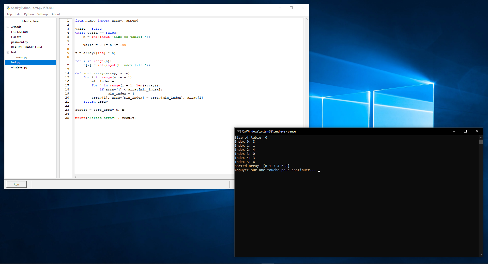
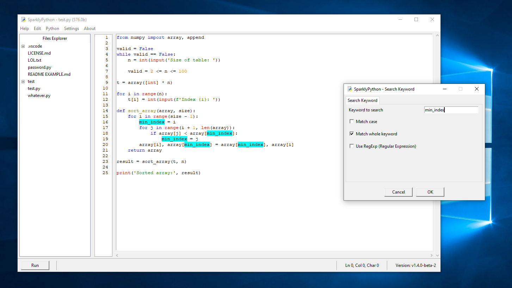
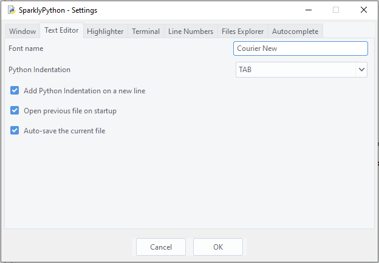

# SparklyPython
SparklyPython is a powerful and open-source Python IDE based on Tkinter. It provides many features, fully customizable, and beginner-friendly!

- Highlighter for Python syntax
- Powerful Python Autocomplete
- Files Explorer to navigate files easily
- Beginner-friendly and easy to use

## 📥 Download

To download the application, simply go to [releases](https://github.com/TFAGaming/SparklyPython/releases/latest) and scroll down until you find the assets, click on the **.zip** file to download it. When the download finishes, unzip the compressed folder to a normal folder and start the application by running the file **SparklyPython.exe**.

Ensure SparklyPython has permission to write and read files because if these permissions are missing, the application will return many errors and eventually crash.

## 💿 Convert `.py` to `.exe`

To convert the main source code of SparklyPython to an executable file, you must install [PyInstaller](https://pyinstaller.org/en/stable/) and then use the following command for the conversion:

```sh
pyinstaller main.py -w --icon=icon.ico
```

PyInstaller will eventually make two directories, "build" and "dist". The important folder is the "dist" because it contains every **.dll** file and modules that makes the app run on any operating system, so you can delete the "build" folder, drag **icon.ico** to the **build/main** folder, and convert the **build/main** to a compressed file (**.zip**).

## 🐛 Known bugs
- If the configuration file has a missing property while the settings window is loading the file, it will eventually stop the window from getting ready.
- When modifying a keyword plugin that has a dot behind the current word by selecting an option from the SparklyPython Autocomplete list, it will remove anything behind the current word and replace it with the selected keyword. For an example, the full string `test_class.test_funct...` will be replaced by `test_function` only, not `test_class.test_function`.
- When Files Explorer loads many files and directories, the app might freeze and eventually crash. If the application is being used while Explorer is loading, it might use a lot of RAM, which eventually slows down the device.

## 🖼️ Screenshots




## 📄 License
The **MIT** License ([view here](./LICENSE))