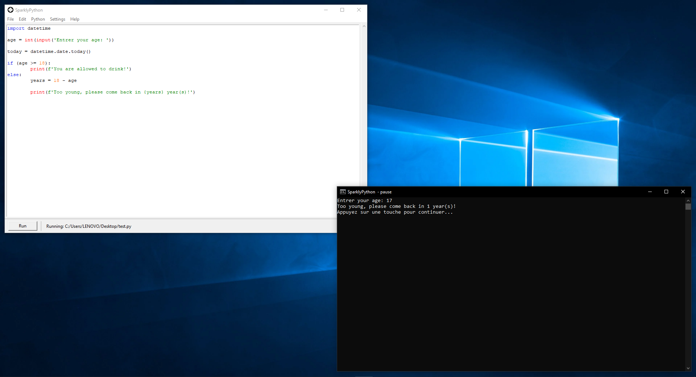
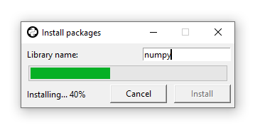
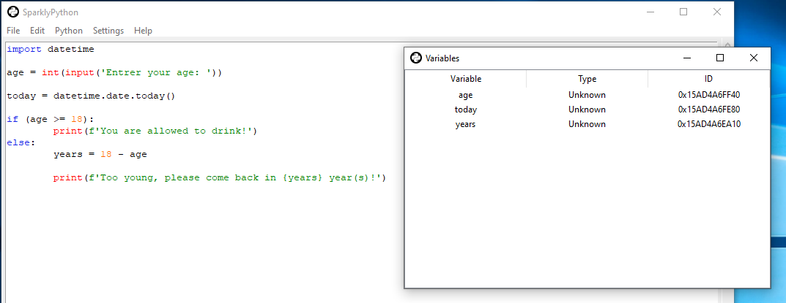

# SparklyPython
SparklyPython is the most powerful and open-source Python IDE, fully written in Python and using Tkinter for GUI.

You can convert the main file `main.py` to an `.exe` file using [PyInstaller](https://pypi.org/project/pyinstaller/).

## Screenshots

## License
The MIT License ([View here](./LICENSE))