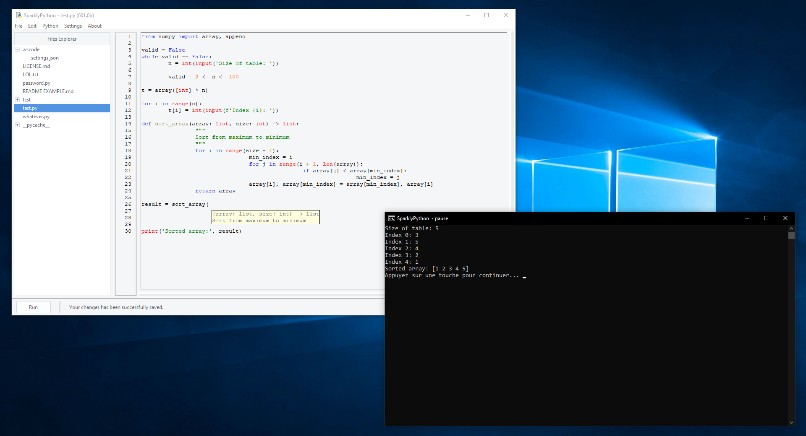
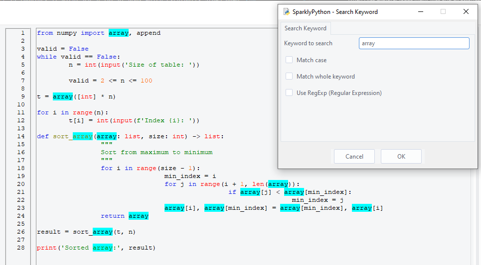

# SparklyPython
The most powerful, beginner-friendly, and open-source Python IDE, fully written in Python and using Tkinter for GUI.

You can convert the main file `main.py` to an `.exe` file using [PyInstaller](https://pypi.org/project/pyinstaller/). The command was used is here:

```
pyinstaller main.py -w --icon=icon.ico
```

Enjoy while using SparklyPython! =)

## Screenshots




## License
The MIT License ([View here](./LICENSE))